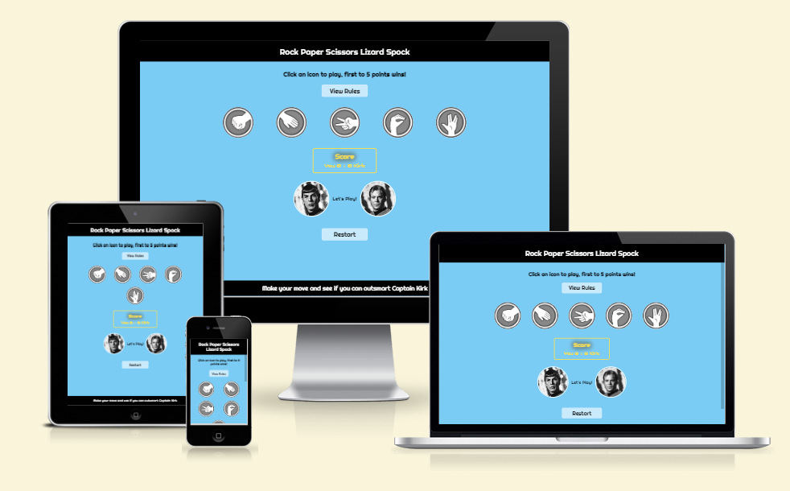
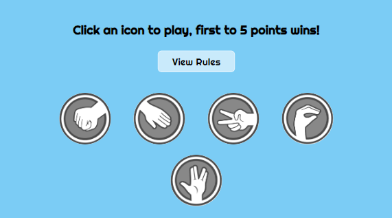
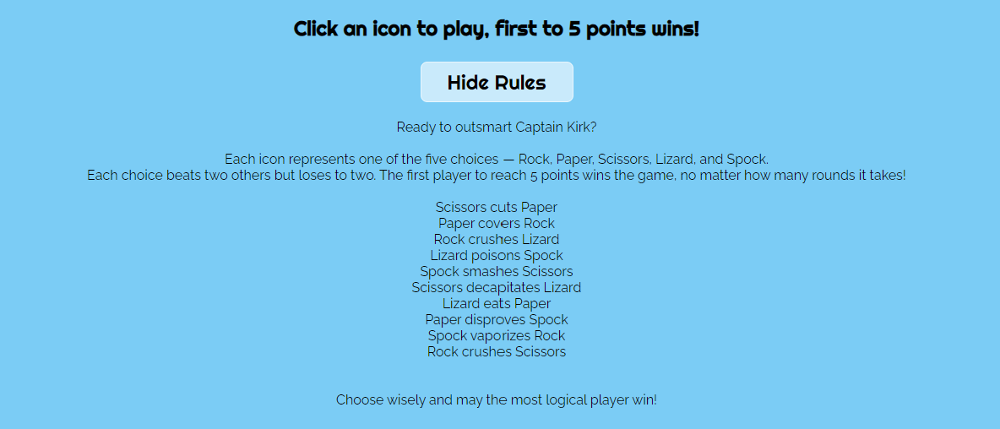

# Rock Paper Scissors Lizard Spock Game

The [Rock Paper Scissors Lizard Spock game](https://sophiedufrane.github.io/PP2_Rock_Paper_Scissors_Lizard_Spock_Game/) is an extension of the classic **Rock Paper Scissors** game, introducing two additionnal options with **Lizard** and **Spock**.

The game is designed to offer entertainment for fans of the original game as well as for the enthusiasts of *The Big Bang Theory* where it became popular. Just to mention that this version was initially invented by *Sam Kass* before being mentioned on the TV show.

The player is looking for a fun, quick, and interactive gaming experience, whether he/she is familiar with the game or discovering it for the first time, the game’s intuitive and responsive interface makes it easy to jump in and start playing immediately.

The game’s options and rules can easily been understood due to the clean design, accessible instructions, and dynamic feedback. It’s engaging because each round is fast-paced, and the clear score tracker keeps the game competitive. The toggleable rules section ensures new player can learn or review the rules.

The humorous connection to Captain Kirk as the computer opponent adds an extra layer of personality to the game, especially for Star Trek fans.

Overall, the website offers an accessible, responsive, and fun experience, ideal for quick entertainment.

Finally and on another note, this game also showcases Javascript's ability to create dynamic, real-time games and responsive user interfaces.

## Features:

The game is packed with features that enhances user engagement, including dynamic scores updates, interactive rules and responsive design that works across different devices and screens sizes.

Here the key features:

### Existing Features:

- **Game Header**
  - The game title is display at the top, the font-family and font-size have been chosen to set up the theme: users immediately know they are in for a fun twist on the classic game. The font-family and color scheme are inspired by the Star Trek universe, adding a thematic connection to the game's sci-fi roots.

  

- **Interactive game console**
  - The player is invited to choose from the 5 options: **Rock**, **Paper**, **Scissors**, **Lizard**, or **Spock** by clicking the corresponding icons. A feature highlights the icons when the mouse hovers over them.

  - The game is played in rounds, and the first player to reach 5 points wins the game.

  

- **Rules Section**
  - The game includes a toggle button at the top of the console section, that hides or displays the rules. This feature ensures that players can quickly make their choice and learn the winning combinations. The toggle function enhances the overall user experience by decluttering the game area. When the rules are visible, the button prompts the player to hide the section again, ensuring a focused game interface.

  

- **Result section**
  - The game tracks the player's and Capitain Kirk's scores in real-time. It also tracks the round number. The first to reach 5 points is declared winner. 

  - The result of each round is dynamically updated: the player's and computer's selection are reflected in the game console, making it easy to see who is winning each round. It also shows what rule applies and determines the winner. 
  For example, if you loose with "Paper disproves Spock", it’s immediately displayed offering a clear feedback.

  
  

- **Restart Button**
  - A "Restart" button is available at any time to reset the game to its default state, allowing players to start again when the game is over or whenever they want to.

  

- **Footer**
  - The footer includes a fun nod to Captain Kirk as the computer opponent, reminding players to "Make your move and see if you can outsmart Captain Kirk." This playful twist adds a bit of humor and personality to the game, especially for fans of Star Trek.

  

### Features left to implement:

- **Multiplayer Mode**
  - A future update could allow two players to compete against each other instead of playing against the computer.

- **Score Persistence**
  - A feature that saves scores across sessions could be implemented so that users can keep track of their wins and losses.

### Bugs, Fixes

- **Variable not accessible**: I defined a variable within a function preventing other parts of the code from accessing it. This led to unexpected behavior in the game flow. I fixed this by defining the variable outside the function, allowing it to be used globally within the game logic.

- **Wrong Data Type**: I was trying to use data that was in the wrong format causing logic errors when comparing the player's selection with the computer's. The fix here was to use parseInt() to convert the string to a number, ensuring that comparisons worked correctly.

- **Function order dependency**: Initially, the function order was causing issues in the game flow. For example, the checkGameOver() function was being called after the game logic, leading to incorrect game-over conditions. By reorganizing the order, the game now correctly checks if the game is over before continuing with the next round.

- **Image display issue**: When I moved from using strings to numbers for game selections, the icons stopped displaying properly because the logic didn’t match the new numeric selection system. I adjusted the mapping between numeric selections and corresponding icons, for the images to display correctly.

- **Function over complicated**: The game’s initial logic was too complex, relying on multiple if-else statements that made the code hard to maintain. By using an object that mapped all possible game combinations (e.g., Rock crushes Scissors), the game logic became more efficient and easier to read.

### Learning Experiences

I received valuable recommendations from my mentor, which helped refine the project too:

  - **User Experience**: I added a toggle for the game rules, keeping the interface uncluttered while providing easy access to instructions.

  - **JavaScript Optimisation**: I combined related functions, named anonymous ones, and simplified the toggle feature by using a CSS class instead of manipulating content through JavaScript.

  - **Consistent Choices**: Assigning unique constant values (0-4) for each choice improved code consistency and reduced the risk of typos.

  - **Game Over**: I implemented a function to stop the game and declare a winner once a player reaches the maximum points. Before that the game was running indefinitely without a clear conclusion.

## Testing:

The game has been tested to ensure that it works smoothly across different browsers and devices, including desktop and mobile screens. Here’s an overview of the testing process:

### Feature Functionality Testing

- **Website Accessibility and Browser Compatibility**: Tested in the following browsers:
  - Google Chrome
  - Microsoft Edge
  - Mozilla Firefox

- **Responsive Design**: Tested on various screens sizes, including mobile devices, tablets, and desktops, ensuring a seamless experience.

- **Rules Toggle**: Clicked the "Rules" button to check that the rules section toggles between show/hide without affecting other elements.

- **Game Rounds**: Selected each of the five game options (Rock, Paper, Scissors, Lizard, Spock) and verified the game processed the choices and displayed the correct outcomes.

- **Score Tracking**: Played multiple rounds to ensure both player and Captain Kirk scores were updated as expected and the round count incremented correctly.

- **Game Over Logic**: Played until one side reached 5 points, checking that the game ended and displayed the winner properly.

- **Restart Functionality**: Clicked the "Restart" button to ensure the game reset all scores, round number, and choices to default without any glitches.

- **Mobile Usability**: Tested the game on various mobile devices to ensure all buttons were accessible and gameplay remained smooth.

### Validator Testing

- **HTML**: No errors were found when passing the code through the [W3C Validator](https://validator.w3.org/).
- **CSS**: No errors were found when passing the stylesheet through the [Jigsaw Validator](https://jigsaw.w3.org/css-validator/).
- **JavaScript**: No major issues were detected through [JSHint](https://jshint.com/).
The following metrics were returned:
  - There are 11 functions in this file.
  - Function with the largest signature take 2 arguments, while the median is 0.
  - Largest function has 11 statements in it, while the median is 5.
  - The most complex function has a cyclomatic complexity value of 5 while the median is 2.

- **Lighthouse**: No major issues were detected.
    - Performance 94%.
    - Accessibility 91%.
    - Best practices 100%
    - SEO 100%

### Deployment Steps

The site was deployed to Github following the steps below:

1. Navigate to the repository on GitHub.
2. Click on the "Settings" tab.
3. Scroll down to the "GitHub Pages" section.
4. In the source dropdown menu, select the "main" branch and "Root" Folder.
5. Go back to the "Code" tab and refresh.
6. The ribbon at the top will display a green check when it has been deployed correctly.
7. On the "Deployment" section check the link for the deploid website.

The live link can be found here: [Rock Paper Scissors Lizard Spock game](https://sophiedufrane.github.io/PP2_Rock_Paper_Scissors_Lizard_Spock_Game/)

### Content

- The game mechanics and logic were inspired by the **Rock Paper Scissors Lizard Spock** variation from "The Big Bang Theory", initially invented by Sam Kass.
  
### Media

- Icons used for the game were sourced from [PNG Wing](https://www.pngwing.com/en/free-png-pzysy).
- The 2 pictures of Spock and Capitain Kirk were sourced from [Greg Dampier](https://www.gregdampier.com/comics/color/captain-kirk-spock-star-trek).